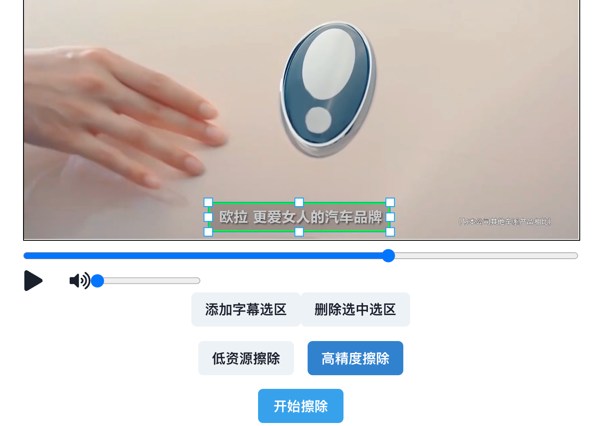

# 视频字幕擦除TOY
## Step 1
启动后端擦除服务
```
$ cd backend
参照Readme启动
http://localhost:8081/docs
```  

## Step 2
启动前端demo
```
$ cd vite-video-subtitle
参照Readme启动
http://localhost:8082/
```  


## 示意
### 原始视频
[source.mp4](examples/source.mp4)
<!-- <video controls width="640" height="360">
    <source src="examples/source.mp4" type="video/mp4">
    Your browser does not support the video tag.
</video> -->

### 打标


### 完成视频
[wipe.mp4](examples/wipe.mp4)
<!-- <video controls width="640" height="360">
    <source src="examples/wipe.mp4" type="video/mp4">
    Your browser does not support the video tag.
</video> -->
