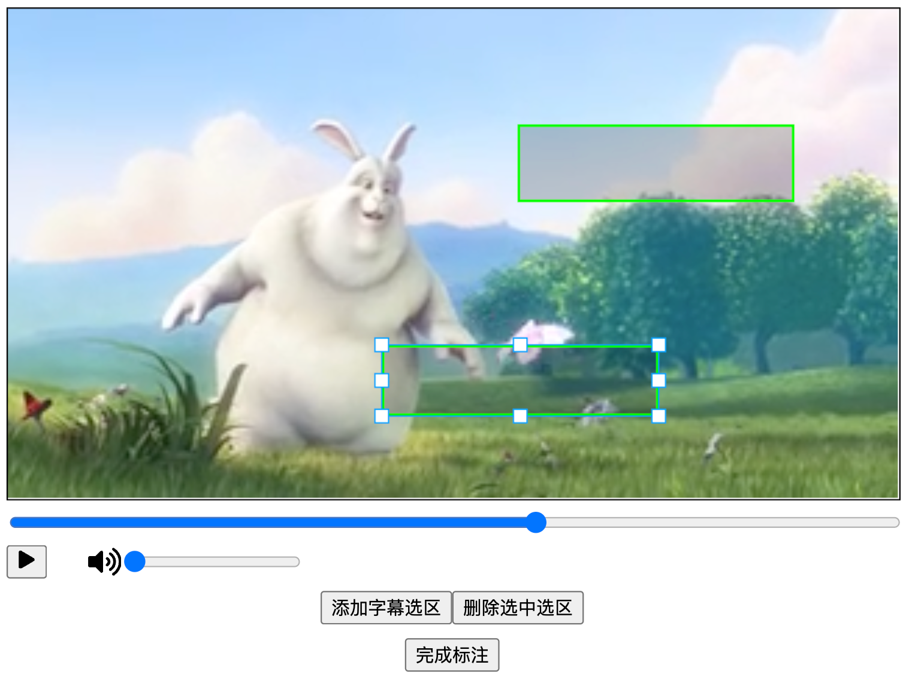

# Video-Subtitile-Wipe
**A toy tool to wipe subtitles of video**
- Composed with `react-player` and `konva`   
- Use Vite-React template  

## ENV && RUN

```
$ apt update
$ apt install nodejs npm -y
$ curl -o- https://raw.githubusercontent.com/nvm-sh/nvm/v0.39.0/install.sh | bash
$ source /root/.bashrc
$ nvm install v16.18.1 
# nvm use v16.18.1 for test
$ npm config set registry https://registry.npm.taobao.org/
$ npm install
# modify backend host url in .env
$ npm run dev
```

## Todo
- [ ] 编解码器为`MPEG-4 Video`类型的视频暂不兼容，无法上传加载，需后续优化  
- [ ] 添加用户管理和历史记录数据  
- [ ] 提升简陋UI的鲁棒性


## Step for npm example
标注组件打包demo  
[reference blog](https://www.cnblogs.com/wisewrong/p/16550439.html)      
  
    

step1  
```
组件模块提取到packges目录下，主要为了直观
```
step2  
```
配置vite.config.ts
# 打包到lib文件夹
$ yarn build 
```
step3  
```
配置packge.json
# 发布到npm
$ npm login 
$ npm version patch
# npm publish 
```
demo打包成功 https://www.npmjs.com/package/vite-video-subtitle
